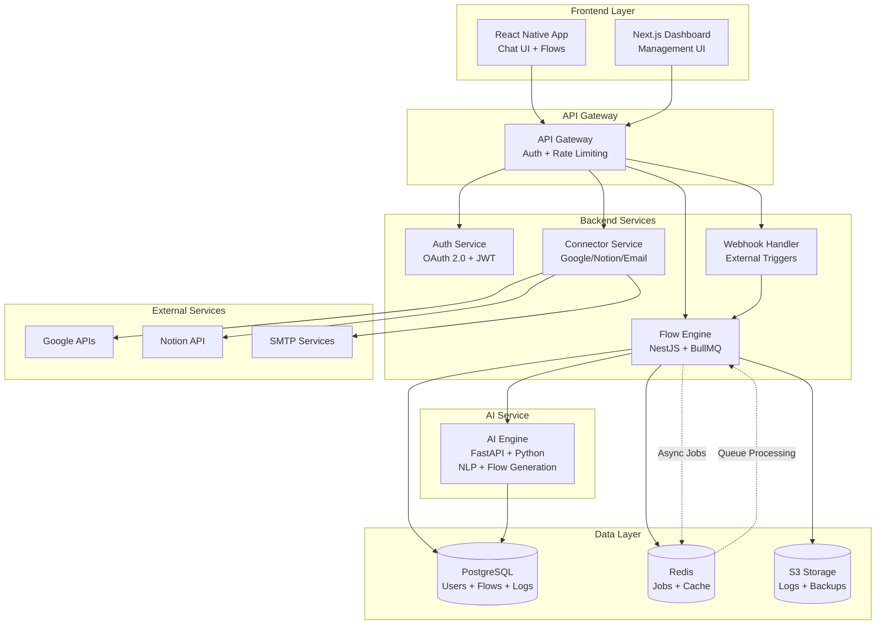

# 🔥 PYRO - Arquitectura Técnica

## Diagrama de Arquitectura (Mermaid)



## Flujo de Datos

### 1. Creación de Automatización
```
Mobile App → API Gateway → Auth Service → Flow Engine → AI Service
                                      ↓
                              PostgreSQL (save flow)
```

### 2. Ejecución de Flujo
```
External Trigger → Webhook Handler → Flow Engine → Connectors → External APIs
                                      ↓
                              Redis (job queue) + PostgreSQL (logs)
```

### 3. Chat con IA
```
Mobile App → API Gateway → AI Service → Flow Engine → Mobile App
```

## Stack Tecnológico por Capa

### Frontend
- **Mobile**: React Native (Expo) + TypeScript
- **Web**: Next.js + TypeScript + TailwindCSS
- **State**: Zustand + React Query
- **Real-time**: Socket.IO

### Backend
- **Main**: NestJS + TypeScript
- **Jobs**: BullMQ + Redis
- **AI**: FastAPI + Python
- **Auth**: OAuth 2.0 + JWT

### Data
- **Primary**: PostgreSQL 15+
- **Cache/Queue**: Redis 7+
- **Storage**: S3 compatible (MinIO dev)

### Infrastructure
- **Container**: Docker + Docker Compose
- **Reverse Proxy**: Nginx
- **Monitoring**: Prometheus + Grafana (future)

## Microservicios

### 1. API Gateway
- Rate limiting
- Authentication middleware
- Request routing
- CORS handling

### 2. Auth Service
- OAuth 2.0 flows
- JWT token management
- User sessions
- Permission checks

### 3. Flow Engine
- Flow parsing/validation
- Trigger management
- Step execution
- Error handling/retries

### 4. AI Service
- Natural language processing
- Flow generation from text
- Flow optimization
- Error explanation

### 5. Connector Service
- External API integrations
- OAuth token management
- Rate limiting per service
- Error mapping

### 6. Webhook Handler
- External trigger接收
- Request validation
- Queue injection
- Response handling

## Database Schema (Simplified)

### Users Table
```sql
- id (UUID, PK)
- email (unique)
- name
- oauth_provider
- oauth_id
- created_at
- limits (JSONB)
```

### Flows Table
```sql
- id (UUID, PK)
- user_id (FK)
- name
- description
- trigger_type
- trigger_config (JSONB)
- steps (JSONB)
- is_active
- created_at
- updated_at
```

### Executions Table
```sql
- id (UUID, PK)
- flow_id (FK)
- status (running/success/failed)
- started_at
- finished_at
- logs (JSONB)
- error_message
```

### Connections Table
```sql
- id (UUID, PK)
- user_id (FK)
- service_name
- oauth_tokens (encrypted)
- created_at
- updated_at
```

## Security Architecture

### Authentication Flow
1. **Mobile App** → OAuth 2.0 (Google)
2. **Backend** → JWT token generation
3. **API Gateway** → JWT validation
4. **Services** → User context propagation

### Data Protection
- OAuth tokens encrypted at rest
- Database connections with SSL
- API communication HTTPS only
- Sensitive data in Redis encrypted

### Sandboxing
- User isolation by tenant ID
- Flow execution in separate processes
- Resource limits per user
- Audit logging for all actions

## Scaling Considerations

### Horizontal Scaling
- Stateless API Gateway
- Multiple Flow Engine instances
- Redis cluster for job queues
- PostgreSQL read replicas

### Performance Optimization
- Redis caching for frequent queries
- Connection pooling for external APIs
- Batch processing for bulk operations
- CDN for static assets

## Development vs Production

### Development
- Docker Compose with all services
- Local PostgreSQL + Redis
- Mock external APIs
- Hot reload enabled

### Production
- Kubernetes deployment
- Managed PostgreSQL + Redis
- Real external API connections
- Monitoring + alerting
- Backup strategies
